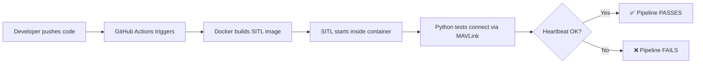

# ArduPilot SITL CI/CD Pipeline

> Automated Build, Simulate & Test pipeline for ArduPilot drone firmware using Docker and GitHub Actions.

[](https://github.com/MahboobAlam0/ArduPilot_devops/actions/workflows/ci.yml)

---

## What This Project Does

This is a **DevOps project** that demonstrates how to build a CI/CD pipeline for drone simulation software. It:

1. **Containerizes** the ArduPilot SITL (Software-In-The-Loop) simulator using Docker
2. **Automates** build and test execution using GitHub Actions
3. **Validates** simulator health through MAVLink protocol tests

> **Think of it this way:** The drone simulator is the *application*. This project is the *infrastructure and automation* around it.

---

## Architecture



---

## Tech Stack

| Layer | Tool | Purpose |
|-------|------|---------|
| Source Control | GitHub | Version control + CI trigger |
| CI/CD | GitHub Actions | Pipeline orchestration |
| Containerization | Docker + Compose | Reproducible SITL environment |
| Simulator | ArduPilot SITL | Virtual ArduCopter drone |
| Test Framework | pytest + pymavlink | MAVLink health-check tests |

---

## Project Structure

```
.
├── .github/workflows/
│   └── ci.yml              # CI pipeline definition
├── docker/
│   └── Dockerfile          # SITL container image
├── scripts/
│   └── start_sitl.sh       # SITL entrypoint script
├── tests/
│   ├── __init__.py
│   └── test_heartbeat.py   # Automated MAVLink tests
├── docker-compose.yml      # Container orchestration
├── requirements.txt        # Python dependencies
└── README.md               # This file
```

---

## How to Run Locally

### Prerequisites
- Docker Desktop installed and running
- Python 3.10+
- Git

### Steps

```bash
# 1. Clone the repo
git clone https://github.com/MahboobAlam0/ArduPilot_devops.git
cd ArduPilot_devops

# 2. Build the SITL Docker image (takes ~15 min first time)
docker compose build

# 3. Start the simulator
docker compose up -d

# 4. Wait for SITL to be ready (check health status)
docker ps  # Look for "healthy" status

# 5. Install test dependencies
pip install -r requirements.txt

# 6. Run the tests
pytest tests/test_heartbeat.py -v

# 7. Tear down
docker compose down
```

---

## What the Tests Verify

| Test | What it checks | Why it matters |
|------|---------------|----------------|
| `test_heartbeat_received` | SITL sends MAVLink heartbeat | Proves simulator is alive |
| `test_vehicle_type_is_quadrotor` | Vehicle type = quadrotor | Confirms correct firmware |
| `test_autopilot_is_ardupilot` | Autopilot = ArduPilotMega | Validates expected software |
| `test_system_status` | Status = STANDBY/ACTIVE | Confirms no boot errors |

---

## CI Pipeline

On every push or PR to `main`:

1. **Checkout** → code pulled onto runner
2. **Build** → Docker image compiled with layer caching
3. **Start** → SITL container launched in background
4. **Health check** → polls until SITL is ready (max 180s)
5. **Test** → pytest runs MAVLink validation suite
6. **Teardown** → containers removed, logs uploaded on failure

---

## Honest Limitations

| Limitation | Explanation |
|-----------|-------------|
| SITL ≠ real hardware | Industry standard for CI; real hardware is for integration testing |
| No deployment stage | Deploying to physical drones requires hardware |
| No cloud infrastructure | Intentionally local Docker + GitHub-hosted runners |
| Single vehicle only | Multi-vehicle adds complexity without DevOps value |
| Long initial build (~15 min) | ArduPilot source compilation is inherently slow; Docker caching helps |
| No security scanning | Could add Trivy/Snyk in future iterations |

---

## Future Improvements

- [ ] Add container vulnerability scanning (Trivy)
- [ ] Add test for autonomous takeoff command
- [ ] Multi-vehicle simulation
- [ ] Slack/Discord notifications on pipeline failure
- [ ] Docker image push to registry (GHCR)
- [ ] Pre-built SITL binary caching to speed up CI

---
