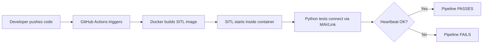

# CI/CD Pipeline for Drone Autopilot Software using SITL-based Testing

[](https://github.com/MahboobAlam0/ardupilot_devops/actions/workflows/ci.yml)

---

## 1. Problem Statement

Drone autopilot software is **safety-critical**.
A faulty firmware build can lead to mission failure or physical damage if deployed without proper validation.
Manual testing is risky, inconsistent, and does not scale.

This project demonstrates how **DevOps automation** can be applied to drone software by validating autopilot behavior in a simulated environment before release.

---

## 2. Why Simulation (SITL)

Physical drone testing is:

- **Expensive** — real hardware costs $500+
- **Risky** — bugs cause crashes and physical damage
- **Not suitable for CI/CD** — you can't plug a drone into a CI runner

This project uses **Software-In-The-Loop (SITL)** with ArduPilot to enable:

- Safe testing without hardware
- Fast, repeatable validation
- Automation inside CI pipelines

SITL runs the **exact same firmware** as a real drone. It allows us to validate autopilot communication and system health before any real-world deployment.

---

## 3. System Architecture

```
Developer Pushes Code
        |
        v
CI Pipeline (GitHub Actions)
 ├── Build ArduPilot (Docker)
 ├── Start SITL (quadcopter)
 ├── Run automated MAVLink heartbeat test
 └── Store logs & artifacts
```



The pipeline follows a **fail-fast** approach:
if the simulated drone does not respond correctly, the pipeline fails immediately.

---

## 4. Testing Strategy

This project focuses on basic but meaningful automated validation.

### Implemented Tests

| Test | What it validates | Failure means |
|------|-------------------|---------------|
| `test_heartbeat_received` | SITL sends MAVLink heartbeat | Simulator is broken |
| `test_vehicle_type_is_quadrotor` | Vehicle type = quadrotor | Wrong firmware loaded |
| `test_autopilot_is_ardupilot` | Autopilot = ArduPilotMega | Unexpected software on port |
| `test_system_status` | Status = STANDBY/ACTIVE | SITL booted with errors |

### Why Heartbeat Testing?

- Confirms autopilot is running
- Confirms communication channel is healthy
- Acts as a minimal health check for the system

If heartbeat is **not received**, the firmware is considered unsafe to proceed further.

This aligns with DevOps principles of **early detection** and **automation**.

---

## 5. CI/CD Workflow

1. CI is triggered on code push
2. ArduPilot is built automatically (inside Docker)
3. SITL is started in the pipeline
4. Automated tests are executed
5. Pipeline fails on any validation error

The CI pipeline is implemented using **GitHub Actions** and runs without any manual intervention.

### Pipeline Steps

| Step | What happens |
|------|-------------|
| Checkout | Code pulled onto GitHub runner |
| Build | Docker image compiled with layer caching |
| Start | SITL container launched in background |
| Health check | Polls port 5760 until SITL is ready (max 180s) |
| Test | pytest runs 4 MAVLink validation checks |
| Teardown | Containers removed, logs uploaded on failure |

---

## 6. Production Mindset (Conceptual)

While this project does not deploy to real drones, it follows **production-ready thinking**:

- Firmware artifacts can be **versioned** (Dockerfile pins `Copter-4.5.7`)
- Failed builds are **blocked automatically** (CI fails → PR blocked)
- Simulation acts as a **pre-deployment gate**

The same approach can be extended to:

- Hardware-in-the-loop (HIL) testing
- Release signing
- Rollback strategies (revert git commit → Docker rebuilds from pinned tag)

---

## 7. Limitations

This project intentionally limits scope to remain realistic for a fresher-level DevOps implementation.

| Limitation | Reason |
|-----------|--------|
| No hardware-in-the-loop (HIL) testing | Requires physical autopilot hardware |
| No real drone deployment | Requires hardware + safety infrastructure |
| No cloud infrastructure (AWS/Kubernetes) | Scope limited to DevOps fundamentals |
| Testing limited to basic system health checks | Sufficient for CI validation |
| Long initial Docker build (~15 min) | ArduPilot compiles from source |

These constraints were applied to focus on **DevOps fundamentals** rather than overengineering.

---

## 8. Basic Drone System Context

This project uses only essential drone concepts:

| Component | Tool Used |
|-----------|-----------|
| Autopilot | ArduPilot |
| Simulation | SITL (Software-In-The-Loop) |
| Communication Protocol | MAVLink |
| Drone Type | Quadcopter |
| Ground Control Station | QGroundControl (manual use) |

The focus is on **automation**, not flight dynamics or drone physics.

---

## 9. Key Takeaway

This project demonstrates how DevOps practices can be applied to drone software by:

- **Automating builds** inside Docker containers
- **Validating behavior** in simulation via MAVLink
- **Preventing faulty software** from progressing further

Drone knowledge is used only to design meaningful automated tests, not to implement flight algorithms.

---

## Project Structure

```
.
├── .github/workflows/
│   └── ci.yml              # CI pipeline definition
├── docker/
│   └── Dockerfile          # SITL container image
├── scripts/
│   └── start_sitl.sh       # SITL entrypoint script
├── tests/
│   ├── __init__.py
│   └── test_heartbeat.py   # Automated MAVLink tests
├── docker-compose.yml      # Container orchestration
├── requirements.txt        # Python dependencies
└── README.md               # This file
```

---

## How to Run Locally

### Prerequisites
- Docker Desktop installed and running
- Python 3.10+
- Git

### Steps

```bash
# 1. Clone the repo
git clone https://github.com/MahboobAlam0/ardupilot_devops.git
cd ardupilot_devops

# 2. Build the SITL Docker image (takes ~15 min first time)
docker compose build

# 3. Start the simulator
docker compose up -d

# 4. Wait for SITL to be ready (check health status)
docker ps  # Look for "healthy" status

# 5. Install test dependencies
pip install -r requirements.txt

# 6. Run the tests
pytest tests/test_heartbeat.py -v

# 7. Tear down
docker compose down
```

---

## Tech Stack

| Layer | Tool | Purpose |
|-------|------|---------|
| Source Control | GitHub | Version control + CI trigger |
| CI/CD | GitHub Actions | Pipeline orchestration |
| Containerization | Docker + Compose | Reproducible SITL environment |
| Simulator | ArduPilot SITL | Virtual ArduCopter drone |
| Test Framework | pytest + pymavlink | MAVLink health-check tests |
| Protocol | MAVLink | Drone communication protocol |
